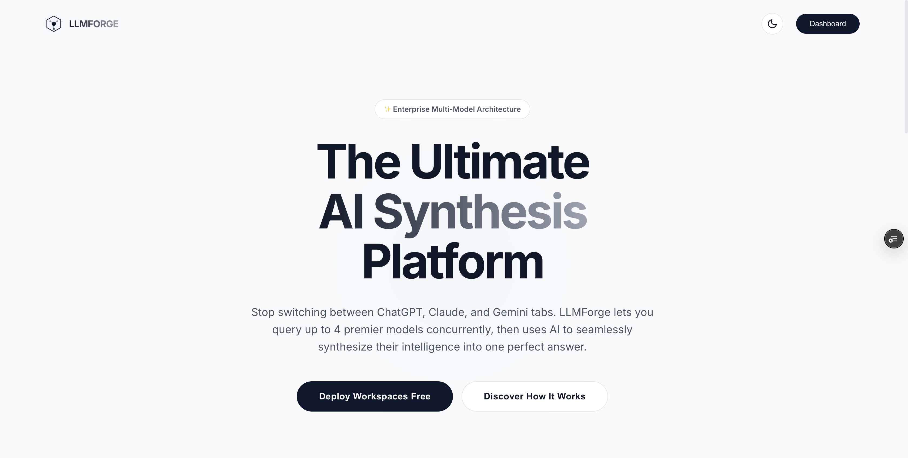
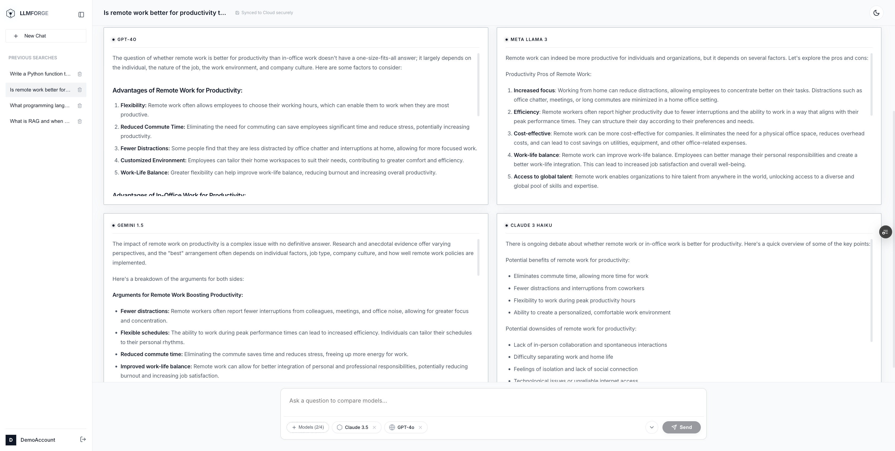
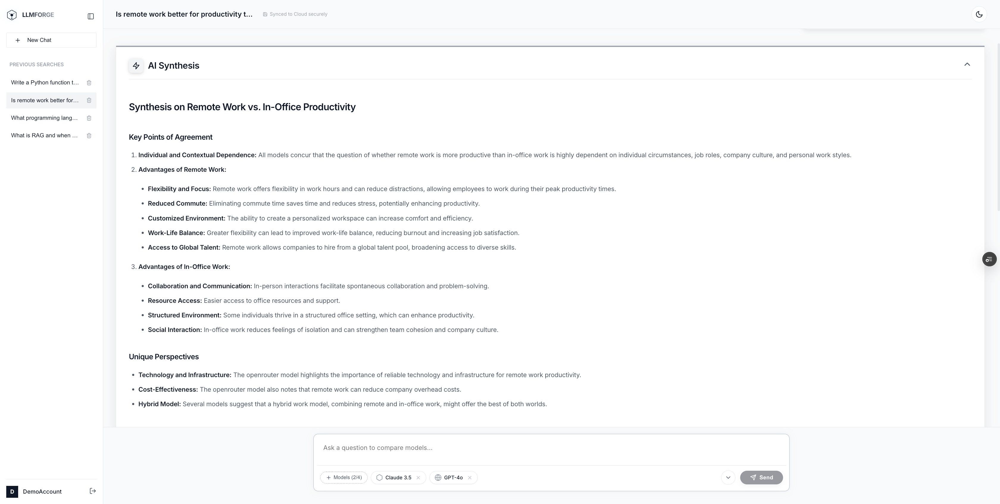
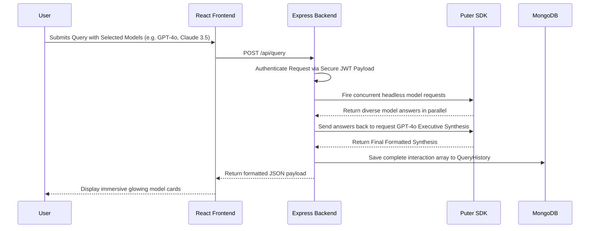
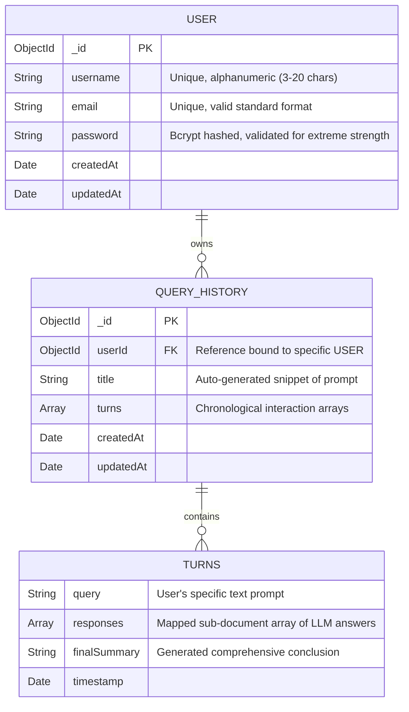

# LLMForge Enterprise

LLMForge is an enterprise-grade AI synthesis and multi-model reasoning platform. It allows users to query multiple state-of-the-art Large Language Models (LLMs) simultaneously and synthesize their responses into a single cohesive executive summary.


---

## 📸 Screenshots







---


## 🏗️ Architecture & Sequential Data Flow

LLMForge completely bypasses the need for individual API keys for OpenAI or Anthropic. It uses **Puter.js** to natively fetch and execute concurrent requests against a managed cloud of 500+ premium AI models.



---

## 🗂️ Project Directory Structure

```text
LLMForge/
├── backend/                  # Node.js + Express + Mongoose
│   ├── config/               # MongoDB connection protocols
│   ├── controllers/          # API Route Logic (Auth Controller & Queries)
│   ├── middleware/           # JWT & Security interceptors
│   ├── models/               # Database Schemas (User & QueryHistory)
│   ├── routes/               # Express endpoint definitions
│   ├── services/             # Puter.js SDK orchestrators (Dynamic LLM polling)
│   ├── server.js             # Global security configurations (Helmet, RateLimit)
│   └── .env.example          # Backend secret templates
├── frontend/                 # React + Vite + Vanilla CSS
│   ├── src/
│   │   ├── components/       # Neon UI elements (QueryBox, Logo, ResponseCards)
│   │   ├── context/          # Global React state (AuthContext)
│   │   ├── pages/            # View routing logic (Dashboard, Home, Login)
│   │   ├── services/         # Axios API interceptors
│   │   └── styles/           # Global enterprise Glassmorphism system (main.css)
│   └── .env.example          # Local frontend variables
├── start-mac.sh              # 🚀 Custom macOS/Linux startup script
├── start-win.bat             # 🚀 Custom Windows startup script
└── README.md                 # You are here
```

---

## 🗄️ MongoDB Database Structure Map

The project relies on a strictly typed, fully mapped MongoDB architecture. Both schemas utilize native Mongoose `{ timestamps: true }` configurations to automatically log `createdAt` and `updatedAt` for backend execution analytics.



---

## 🔒 Maximum API Security Features

This repository is heavily fortified against modern web vulnerabilities. We protect the database using absolute pre-flight and backend validation.
- **Helmet:** Protects against XSS injection and Clickjacking via strict HTTP headers globally.
- **Express-Mongo-Sanitize:** Actively blocks malicious `$gt` or `$ne` NoSQL injection payloads globally across the entire Express router.
- **Express Rate Limit:** Brute-force protection limits the entire API layer to `100 requests / 15 minutes` per IP address.
- **Regex Payload Validation:** Double-layered regex logic occurring simultaneously on the React Frontend (`Login.jsx`) and Node Backend (`authController.js`) ensures malformed payloads are rejected instantly.

---

## 🚀 Setup & Local Development Commands

LLMForge features custom automated startup protocols. **Do not run `npm run dev` manually!** Instead, follow these steps to securely configure your `.env` blocks and boot the environment arrays.

### 1. Environment Configuration

1. **For Backend**: Navigate to `backend/` and copy the `.env.example` file to `.env`. You **MUST** insert your MongoDB Cluster URI and your Puter Token for the engine to initialize.
2. **For Frontend**: Navigate to `frontend/` and copy the `.env.example` file to `.env`. This links your Vite frontend to the local API structure.

### 2. Install Dependencies

You need to initialize the Node modules in both independent directories:
```bash
cd backend && npm install
cd ../frontend && npm install
cd ..
```

### 3. Automated Developer Boot
We have embedded custom startup scripts directly into the root. These scripts automatically audit your `.env` files to guarantee they are not empty before allocating port bandwidth and spinning up the APIs. 

**For macOS / Linux Systems:**
```bash
chmod +x start-mac.sh
./start-mac.sh
```

**For Windows Systems:**
```cmd
start-win.bat
```
